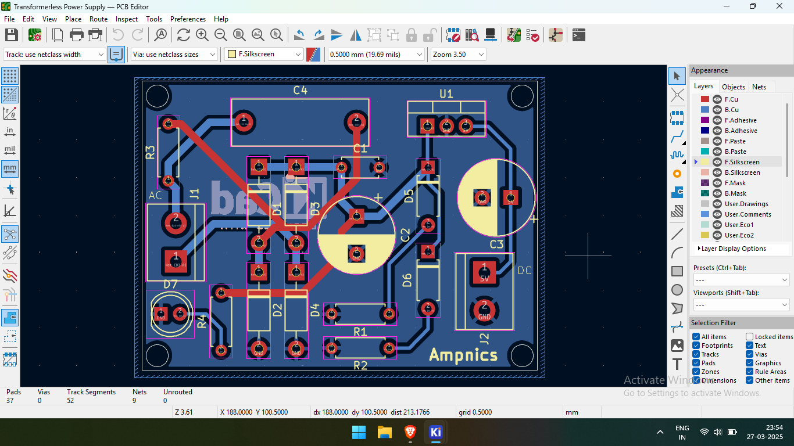
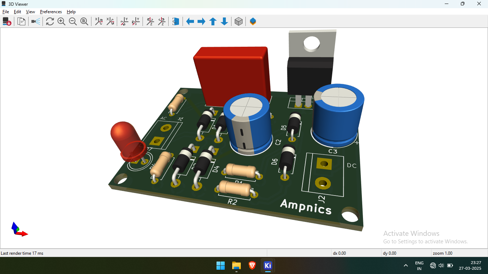

# ⚡ Transformerless Power Supply PCB

## 📌 Overview  
This is a **PCB design** for a **Transformerless Power Supply**, created using **KiCad**. This circuit provides a **regulated 5V DC output** using an **LM7805 voltage regulator**. The design eliminates the need for bulky transformers, making it compact and efficient.

## 🛠️ Specifications  
- **Input Voltage**: AC Mains (220V AC)
- **Output Voltage**: 5V DC (regulated)
- **Components Used**:  
  - **Diodes**: 4 × IN4007  
  - **Zener Diodes**: 2 × Zener (for voltage regulation)  
  - **Capacitors**: 2.2µF, 0.1µF (normal) & 1000µF, 470µF (polarized)  
  - **Resistors**: 1MΩ, 20KΩ, 20KΩ, 2.2KΩ  
  - **Voltage Regulator**: LM7805  
  - **Indicator**: LED with a series resistor  
  - **Screw Terminals**: For AC input & DC output  

## 📂 Project Files  
- **Schematics** → `/Schematics/`  
- **PCB Layout** → `/PCB_Design/`  
- **Gerber Files** → `/Gerber_Files/` (for manufacturing)  
- **Images** → `/Images/` (renders & screenshots)  

## 🖼️ Preview Images  
| Schematic | PCB Layout | 3D Render |
|-----------|------------|------------|
|  |  |  |

## 🔧 How to Use  
1️⃣ **Open the KiCad files** in `/Schematics/` and `/PCB_Design/`.  
2️⃣ **Modify the design** if needed and generate Gerber files for fabrication.  
3️⃣ **Use Gerber files** in `/Gerber_Files/` to order a PCB from manufacturers.  

## 🔗 Links  
- 🚀 **Project Discussion on LinkedIn**: [LinkedIn](https://www.linkedin.com/)  
- 📺 **Ampnics Tutorial**: [YouTube Playlist](https://youtube.com/)  

## 📜 License  
This project is licensed under the **MIT License** – feel free to use and modify it!
